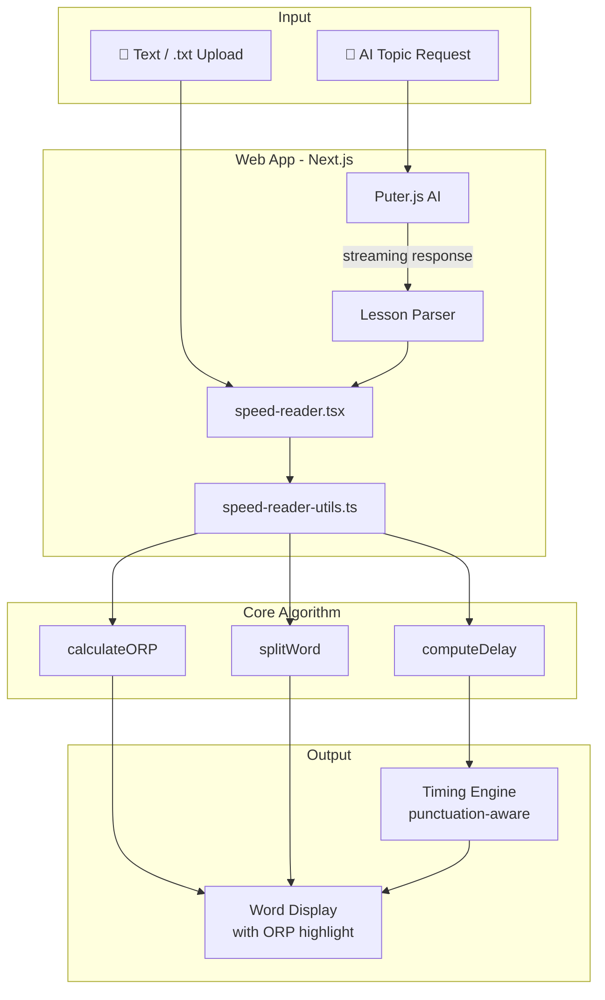

# RSVP Speed Reader

> A speed reading application built around RSVP (Rapid Serial Visual Presentation) and ORP (Optimal Recognition Point) — designed to improve reading speed and focus, particularly for users with ADHD.

[](https://github.com/YOUR_USERNAME/YOUR_REPO/actions/workflows/ci.yml)
[](LICENSE)


**[Live Demo](https://YOUR_DEMO_URL_HERE)** &nbsp;|&nbsp; [Web App](web/) &nbsp;|&nbsp; [Python Desktop App](speed_reader.py)

---

<!-- Once you have a demo GIF, replace this comment with:  -->

---

## How It Works

### RSVP — Eliminate eye movement
Traditional reading requires your eyes to scan across the page — studies show this accounts for roughly 80% of total reading time. RSVP displays words one at a time in the same position, eliminating eye movement entirely.

### ORP — Highlight the focus point
Each word highlights a single letter in red: the Optimal Recognition Point, positioned slightly left of center where the eye naturally focuses. This lets the brain recognize words without conscious effort.

### Smart pacing
Punctuation-aware timing adds natural pauses — 1.5× delay at sentence endings, 1.2× at clause boundaries — so the reading flow stays comfortable at any speed.

---

## Quick Demo

No setup needed to try the web app:

1. `cd web && npm install && npm run dev` → open [http://localhost:3000](http://localhost:3000)
2. Paste any text or upload a `.txt` file — try [`sample_text.txt`](sample_text.txt) from this repo
3. Press **Space** to start reading

For AI-generated lessons, click **Generate with AI**, enter a topic, and sign in to a free [Puter.js](https://puter.com) account when prompted. No API key required.

---

## Technical Highlights

| Highlight | Detail |
|-----------|--------|
| **Custom ORP algorithm** | Pure function mapping word length → highlight index, consistent across both implementations and covered by dedicated test suites |
| **Punctuation-aware timing** | `computeDelay()` applies per-character multipliers (`.!?` → 1.5×, `,;:` → 1.2×) to maintain natural reading rhythm |
| **Dual implementation** | Python prototype (tkinter) and production Next.js web app share the same core algorithm — demonstrates progression from prototype to polished product |
| **AI integration without a backend** | Puter.js streams LLM responses directly in the browser — zero server, zero API keys, zero cost |
| **Lesson parsing with fallbacks** | Custom parser handles structured (`===LESSON: Title===`) and unstructured AI output gracefully |
| **234 tests across two runtimes** | 135 Vitest tests (TypeScript) + 99 pytest tests (Python) — pure utility functions extracted specifically for testability |
| **TypeScript strict mode** | Full strict coverage, no `any` types, complete type safety across the web app |
| **CI/CD** | GitHub Actions runs tests, type-check, and lint on every push and PR |

---

## Architecture



---

## Implementations

### Web App (`web/`) — Primary

```bash
cd web
npm install
npm run dev
# Open http://localhost:3000
```

Features:
- AI lesson generation via Puter.js (free, no API key)
- Four explanation styles: ELI5, Summary, Technical, With Examples
- 100–800 WPM with speed labels (Chill Mode → Ludicrous Speed)
- File upload with drag-and-drop
- Multi-lesson navigation and lesson export
- Dark ADHD-friendly UI with animations
- Full keyboard control

### Python Desktop App (`speed_reader.py`) — Prototype

No dependencies beyond the Python standard library:

```bash
python speed_reader.py
```

The same ORP algorithm as the web version, implemented as a standalone tkinter GUI.

---

## Keyboard Shortcuts

| Key | Action |
|-----|--------|
| `Space` | Play / Pause |
| `←` | Skip back 5 words |
| `→` | Skip forward 5 words |
| `↑` | Increase speed (+50 WPM) |
| `↓` | Decrease speed (-50 WPM) |
| `Esc` | Restart current content |

---

## Tech Stack

| Layer | Technology |
|-------|-----------|
| Framework | Next.js 16 / React 19 |
| Language | TypeScript 5 (strict) |
| Styling | Tailwind CSS 4 / shadcn/ui / Radix UI |
| AI | Puter.js (browser-based, no server required) |
| Web Tests | Vitest 4 — 135 tests |
| Desktop | Python 3 / tkinter |
| Python Tests | pytest — 99 tests |
| CI | GitHub Actions |

---

## Project Structure

```
speed-reader/
├── .github/workflows/ci.yml   # CI: test + type-check + lint on every push
├── .python-version             # Pins Python 3.11
├── speed_reader.py             # Python desktop app (no external dependencies)
├── tests/
│   └── test_speed_reader.py   # 99 headless pytest tests
├── requirements-dev.txt        # pytest, pytest-cov
├── sample_text.txt             # Sample content — paste into the web app to demo
└── web/                        # Next.js web application
    ├── src/
    │   ├── app/                # Next.js App Router
    │   ├── components/
    │   │   ├── speed-reader.tsx        # Main component (~1000 lines)
    │   │   └── ui/                     # shadcn/ui primitives
    │   ├── __tests__/
    │   │   └── speed-reader-utils.test.ts  # 135 Vitest tests
    │   └── lib/
    │       └── speed-reader-utils.ts   # Pure ORP/timing/parsing utilities
    └── package.json
```

---

## Testing

```bash
# Web — 135 tests
cd web && npm test

# Web — type-check
cd web && npm run type-check

# Python — 99 tests with coverage
pytest tests/ -v --cov=. --cov-report=term-missing

# Total: 234 tests
```

---

## License

[MIT](LICENSE)
